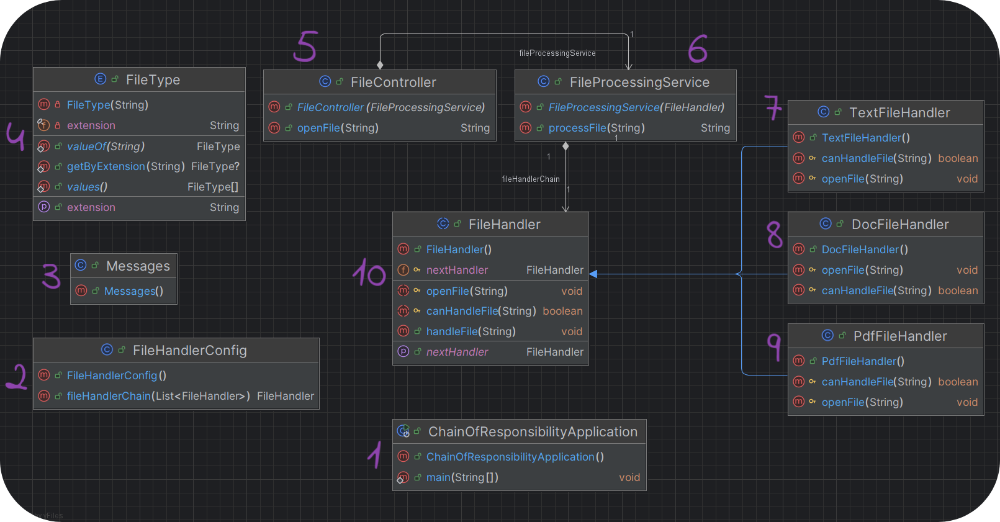
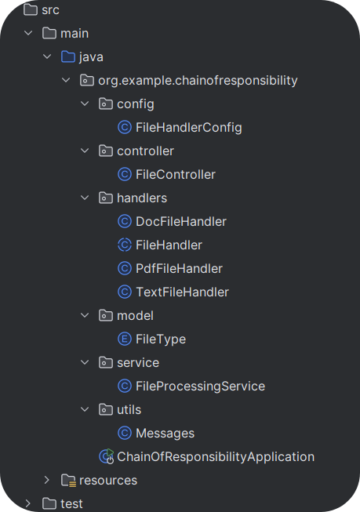

# Chain of Responsibility Pattern in Spring Boot

## Описание

**Chain of Responsibility** (Цепочка ответственности) — это поведенческий паттерн проектирования, который позволяет передавать запросы по цепочке обработчиков. Каждый обработчик может либо обработать запрос, либо передать его дальше по цепочке.

### Основная идея:
Запрос передается от одного обработчика к другому до тех пор, пока не найдется обработчик, способный выполнить запрос. Это обеспечивает гибкость в обработке запросов, так как новые обработчики можно легко добавить в цепочку.

### Преимущества:
- **Гибкость**: Легко добавлять или убирать обработчики, не изменяя существующую логику.
- **Модульность**: Каждый обработчик отвечает только за свою задачу.
- **Реиспользуемость**: Обработчики можно повторно использовать в других цепочках или приложениях.
- **Простота поддержки**: Код легко поддерживать и расширять.
### Сервис без цепочки ответственности:
```java
@Service
@RequiredArgsConstructor
public class BadFileProcessingService {

    private final DocFileHandler docFileHandler;
    private final PdfFileHandler pdfFileHandler;
    private final TextFileHandler textFileHandler;

    public void processFile(String fileName) {
        if (fileName.endsWith(".doc")) {
            docFileHandler.handleFile(fileName);
        } else if (fileName.endsWith(".pdf")) {
            pdfFileHandler.handleFile(fileName);
        } else if(fileName.endsWith(".txt")) {
            textFileHandler.handleFile(fileName);
        } else throw new RuntimeException("File extension does not support!");
    }
}
```
### Сервис с цепочкой ответственности:
```java
@Service
@RequiredArgsConstructor
public class FileProcessingService {

    private final FileHandler fileHandlerChain;

    public String processFile(String fileName) {
        fileHandlerChain.handleFile(fileName);
        return PROCESSING_COMPLETE + fileName;
    }
}
```
- **Обратите внимание, насколько читабельнее стал код**
---

## Реализация в Spring Boot

### 1. Абстрактный класс `FileHandler`

Этот класс является основой для всех конкретных обработчиков. Он содержит базовую логику передачи запроса дальше по цепочке.

```java
@Setter
public abstract class FileHandler {

    protected FileHandler nextHandler;

    public void handleFile(String fileName) {
        if (canHandleFile(fileName)) {
            openFile(fileName);
        } else if (nextHandler != null) {
            nextHandler.handleFile(fileName);
        } else {
            throw new RuntimeException(NO_HANDLERS_FOUND + fileName);
        }
    }

    protected abstract boolean canHandleFile(String fileName);

    protected abstract void openFile(String fileName);
}
```
- **setNextHandler():** Устанавливает следующий обработчик в цепочке.
- **handleFile():** Основной метод обработки. Если текущий обработчик не может обработать запрос, он передает его дальше.
- **canHandleFile() и openFile():** Абстрактные методы, которые будут реализованы в каждом конкретном обработчике.

### 2. Конкретные обработчики файлов
Каждый конкретный обработчик наследует FileHandler и реализует логику для обработки определенного типа файлов.
- **Обработчик текстовых файлов TextFileHandler**

```java
@Component
public class TextFileHandler extends FileHandler {

    @Override
    protected boolean canHandleFile(String fileName) {
        return FileType.TXT.equals(FileType.getByExtension(fileName));
    }

    @Override
    protected void openFile(String fileName) {
        System.out.println("Opening text file: " + fileName);
    }
}
```
- **Обработчик файлов Word DocFileHandler**
```java
@Component
public class DocFileHandler extends FileHandler {

    @Override
    protected boolean canHandleFile(String fileName) {
        return FileType.DOC.equals(FileType.getByExtension(fileName));
    }

    @Override
    protected void openFile(String fileName) {
        System.out.println("Opening Word document: " + fileName);
    }
}
```
- **Обработчик PDF-файлов PdfFileHandler**
```java
@Component
public class PdfFileHandler extends FileHandler {

    @Override
    protected boolean canHandleFile(String fileName) {
        return FileType.PDF.equals(FileType.getByExtension(fileName));
    }

    @Override
    protected void openFile(String fileName) {
        System.out.println("Opening PDF file: " + fileName);
    }
}
```
### 3. Конфигурация цепочки обработчиков
В Spring Boot конфигурация цепочки ответственности может быть выполнена через компонент @Bean. Метод fileHandlerChain создает цепочку обработчиков.
```java
@Configuration
public class FileHandlerConfig {

    @Bean
    public FileHandler fileHandlerChain(List<FileHandler> handlers) {
        if (handlers.isEmpty()) throw new IllegalStateException(NO_HANDLERS_AVAILABLE);

        // Проходим по списку обработчиков и создаем цепочку
        for (int i = 0; i < handlers.size() - 1; i++) {
            handlers.get(i).setNextHandler(handlers.get(i + 1));
        }

        // Возвращаем первый обработчик, начало цепочки
        return handlers.get(0);
    }
}
```
- **List<FileHandler> handlers:** Spring автоматически передает список всех обработчиков файлов, зарегистрированных как бины (например, TextFileHandler, DocFileHandler, PdfFileHandler).
- Метод связывает обработчики в цепочку, передавая каждый запрос следующему обработчику, если текущий не может обработать файл.
### 4. Сервис для обработки файлов
Сервис **FileProcessingService** используется для вызова цепочки обработчиков и обработки файлов.
```java
@Service
@RequiredArgsConstructor
public class FileProcessingService {

    private final FileHandler fileHandlerChain;

    public String processFile(String fileName) {
        // Вызываем обработку файла через цепочку ответственности
        fileHandlerChain.handleFile(fileName);
        return PROCESSING_COMPLETE + fileName;
    }
}
```
---


---
- Весть остальной код, не имеющий прямого отношения к реализации паттерна вы можете найти в файлах репозитория.
