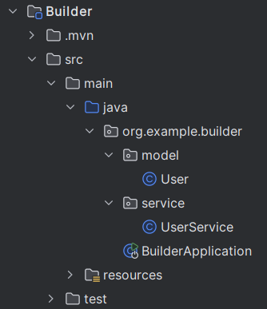

# ENG
# Creational pattern `Builder` in Spring Boot

## Overview
The `Builder Pattern` is a creational design pattern used for step-by-setp construction of complex objects. Instead of using a constructor with numerous parameters, Builder enables creating an object step-by-step by chaining methods, allowing only the necessary fields to be set. 

This pattern is especially useful when:
- The object has many fields, many of which are optional
- You want to improve code readability and avoid issues related to long parameter lists.

## Why use Builder?
1. **Readability**: Builder allows you to clearly see which fields are being set, making the code more understandable.
2. **Flexibility**: You can set only the necessary fields, leaving others with default values.
3. **Ease of Maintenance**: Adding or remove fields becomes easier as you are not bound to a rigid constructor signature.

## Example with Builder
Creating object through a traditional constructor may lead to long parameter list, making maintenance challenging:
```java
public class User {
    private Long id;
    private String name;
    private String email;
    private Integer age;
    private String address;

    public User(Long id, String name, String email, Integer age, String address) {
        this.id = id;
        this.name = name;
        this.email = email;
        this.age = age;
        this.address = address;
    }
}
```
Creating a `User` object like this:
```java
User user = new User(1L, "John Doe", "john@example.com", 30, "123 Main St");
```
is inconvenient and prone to errors, especially if the order of parameters is disrupted.

## Example using `Builder`
With the **Builder** pattern, creating an object becomes much simpler and cleaner:
```java
public class User {
    private final Long id;
    private final String name;
    private final String email;
    private final Integer age;
    private final String address;

    private User(UserBuilder builder) {
        this.id = builder.id;
        this.name = builder.name;
        this.email = builder.email;
        this.age = builder.age;
        this.address = builder.address;
    }

    public static class UserBuilder {
        private Long id;
        private String name;
        private String email;
        private Integer age;
        private String address;

        public UserBuilder setId(Long id) {
            this.id = id;
            return this;
        }

        public UserBuilder setName(String name) {
            this.name = name;
            return this;
        }

        public UserBuilder setEmail(String email) {
            this.email = email;
            return this;
        }

        public UserBuilder setAge(Integer age) {
            this.age = age;
            return this;
        }

        public UserBuilder setAddress(String address) {
            this.address = address;
            return this;
        }

        public User build() {
            return new User(this);
        }
    }
}
```

Now, creating a `User` object looks like this:
```java
User user = new User.UserBuilder()
                .setId(1L)
                .setName("John Doe")
                .setEmail("john@example.com")
                .setAge(30)
                .setAddress("123 Main St")
                .build();
// or
User user = new User.UserBuilder()
                .setId(1L)
                .setName("John Doe")
                .setAddress("123 Main St")
                .build();
// or
User user = new User.UserBuilder()
                .setName("John Doe")
                .build();
```

## Advantages of using Builder
- **Method Chaining**: Each setter returns the builder object (this), allowing you to chain method calls.
- **Reduce Confusion**: No need to remember the order of constructor parameters, minimizing the chance of errors.
- **Optional Parameters**: Easily skip optional parameters without manually setting them in the constructor.

## When to use Builder?
- When you have a class with many fields, and many of them are optional.
- When you want to avoid overloaded constructors (constructors with an increasing number of parameters).

## Conclusion
The **Builder Pattern** simplifies object creation by breaking down the process into individual steps.
This pattern is particularly helpful when objects have many optional fields or complex construction logic.

Using the Builder pattern allows you to:
- Write cleaner and more maintainable code.
- Simplify the object creation process.
- Avoid constructor duplication and improve readability.

---

---

# RU
# Паттерн Проектирования Builder в Java

## Обзор

**Паттерн Builder** — это порождающий паттерн проектирования, который используется для поэтапного создания сложных объектов. Вместо использования конструктора с множеством параметров, Builder позволяет создавать объект поэтапно, используя цепочку методов, и задавать только необходимые поля.

Этот паттерн особенно полезен, когда:
- У объекта много полей, многие из которых являются опциональными.
- Вы хотите улучшить читаемость кода и избежать проблем, связанных с длинными списками параметров.

## Зачем использовать Builder?

1. **Читаемость**: Builder позволяет явно видеть, какие поля устанавливаются, что делает код более понятным.
2. **Гибкость**: Вы можете устанавливать только нужные поля, оставляя остальные со значениями по умолчанию.
3. **Удобство поддержки**: Добавлять или удалять поля становится проще, так как вы не привязаны к жесткой сигнатуре конструктора.

## Пример без использования Builder

При создании объектов через традиционный конструктор вы можете столкнуться с длинными списками параметров, что затрудняет поддержку:

```java
public class User {
    private Long id;
    private String name;
    private String email;
    private Integer age;
    private String address;

    public User(Long id, String name, String email, Integer age, String address) {
        this.id = id;
        this.name = name;
        this.email = email;
        this.age = age;
        this.address = address;
    }
}
```

Создание объекта `User` в таком виде:

```java
User user = new User(1L, "Иван Иванов", "ivan@example.com", 30, "Улица Пушкина, дом Колотушкина");
```

Это неудобно и может привести к ошибкам, особенно если порядок параметров нарушен.

## Пример с использованием Builder

С использованием паттерна **Builder** создание объекта становится гораздо проще и чище:

```java
public class User {
    private final Long id;
    private final String name;
    private final String email;
    private final Integer age;
    private final String address;

    private User(UserBuilder builder) {
        this.id = builder.id;
        this.name = builder.name;
        this.email = builder.email;
        this.age = builder.age;
        this.address = builder.address;
    }

    public static class UserBuilder {
        private Long id;
        private String name;
        private String email;
        private Integer age;
        private String address;

        public UserBuilder setId(Long id) {
            this.id = id;
            return this;
        }

        public UserBuilder setName(String name) {
            this.name = name;
            return this;
        }

        public UserBuilder setEmail(String email) {
            this.email = email;
            return this;
        }

        public UserBuilder setAge(Integer age) {
            this.age = age;
            return this;
        }

        public UserBuilder setAddress(String address) {
            this.address = address;
            return this;
        }

        public User build() {
            return new User(this);
        }
    }
}
```

Теперь создание объекта `User` выглядит так:

```java
User user = new User.UserBuilder()
                .setId(1L)
                .setName("Иван Иванов")
                .setEmail("ivan@example.com")
                .setAge(30)
                .setAddress("Улица Пушкина, дом Колотушкина")
                .build();
```

## Преимущества использования Builder

- **Цепочка вызовов**: Каждый сеттер возвращает объект билдера (`this`), что позволяет вызывать методы по цепочке.
- **Без путаницы**: Вам не нужно помнить порядок параметров конструктора, это снижает вероятность ошибок.
- **Опциональные параметры**: Легко пропускать опциональные параметры, не заполняя их вручную в конструкторе.

## Когда стоит использовать Builder?

- Когда у вас есть класс с множеством полей, и многие из них опциональны.
- Когда вы хотите избежать перегруженных конструкторов (конструкторов с увеличивающимся количеством параметров).
- Когда важно улучшить читаемость и удобство поддержки вашего кода.

## Заключение

Паттерн **Builder** упрощает создание объектов, разбивая процесс на отдельные шаги. Этот паттерн особенно полезен, когда у объектов много опциональных полей или сложная логика создания.

Применяя паттерн Builder, вы сможете:
- Писать более чистый и поддерживаемый код.
- Облегчить процесс создания объектов.
- Избежать дублирования конструкторов и улучшить читаемость.

---

---

Попробуйте использовать этот паттерн в своем следующем Java-проекте, чтобы сделать процесс создания объектов проще!

Приятного кодинга! 💻
