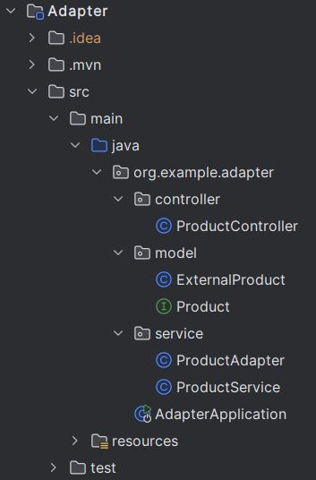

## ENG

# Example of the Adapter Pattern in Spring Boot

## Description

The **Adapter** pattern is a structural design pattern that allows objects with incompatible interfaces to work together. It converts the interface of one class into an interface that is understood by other classes. In Spring Boot, this is particularly useful for integrating with external systems or libraries when their interfaces differ from the application's internal API.

In this project, we will explore the use of the **Adapter** pattern in a real-world scenario: integrating with an external API to retrieve product information.

## Project Structure

- **Product**: An interface that describes a product within our application.
- **ExternalProduct**: A class representing a product retrieved from an external API (with a different set of fields).
- **ProductAdapter**: An adapter that transforms an `ExternalProduct` object into an object compatible with the `Product` interface.
- **ProductService**: A service responsible for fetching product data and adapting it.
- **ProductController**: A REST controller that provides the client with an API to interact with products.

## Example Scenario

Imagine our application expects product information in the `Product` format, but the external API returns data in the `ExternalProduct` format. In this case, the `ProductAdapter` class takes on the task of transforming the data from one format to another, ensuring application compatibility.

## How the Adapter Pattern Works

1. **`Product` Interface**: Describes the product that our application uses.
    ```java
    public interface Product {
        String getName();
        BigDecimal getPrice();
        String getDescription();
    }
    ```

2. **External Product `ExternalProduct`**: Returned by a third-party API, but its structure does not match the `Product` interface.
    ```java
    public class ExternalProduct {
        private String productName;
        private double cost;
        private String details;

        // Getters and constructor
    }
    ```

3. **Adapter `ProductAdapter`**: Converts `ExternalProduct` data into `Product`.
    ```java
    public class ProductAdapter implements Product {
        private final ExternalProduct externalProduct;

        public ProductAdapter(ExternalProduct externalProduct) {
            this.externalProduct = externalProduct;
        }

        @Override
        public String getName() {
            return externalProduct.getProductName();
        }

        @Override
        public BigDecimal getPrice() {
            return BigDecimal.valueOf(externalProduct.getCost());
        }

        @Override
        public String getDescription() {
            return externalProduct.getDetails();
        }
    }
    ```

4. **Service `ProductService`**: Uses the adapter to fetch product data from an external source.
    ```java
    @Service
    public class ProductService {
        public Product getProductFromExternalApi() {
            ExternalProduct externalProduct = new ExternalProduct("Laptop", 1500.0, "High-performance laptop");
            return new ProductAdapter(externalProduct);
        }
    }
    ```

5. **Controller `ProductController`**: Provides data to the client through the API.
    ```java
    @RestController
    @RequestMapping("/products")
    public class ProductController {

        private final ProductService productService;

        public ProductController(ProductService productService) {
            this.productService = productService;
        }

        @GetMapping("/external")
        public ResponseEntity<Product> getExternalProduct() {
            Product product = productService.getProductFromExternalApi();
            return ResponseEntity.ok(product);
        }
    }
    ```

## Running the Project

1. Clone the repository:
    ```bash
    git clone https://github.com/your-repo/spring-adapter-pattern-example.git
    ```

2. Open the project in your IDE and run it as a Spring Boot application:
    ```bash
    ./mvnw spring-boot:run
    ```

3. Open your browser and navigate to:
    ```
    http://localhost:8080/products/external
    ```

You will receive a JSON response with the adapted product data:
```json
{
  "name": "Laptop",
  "price": 1500.0,
  "description": "High-performance laptop"
}
```

---

---

## RU

# Пример паттерна Адаптер на Spring Boot

## Описание

Паттерн **Adapter** (адаптер) — это структурный шаблон проектирования, который позволяет объектам с несовместимыми интерфейсами работать вместе. Он преобразует интерфейс одного класса в интерфейс, понятный другим классам. В Spring Boot это особенно полезно для интеграции с внешними системами или библиотеками, когда их интерфейсы отличаются от внутреннего API приложения.

В этом проекте мы рассмотрим использование паттерна **Adapter** в реальной задаче: интеграцию с внешним API для получения информации о товарах.

## Структура проекта

- **Product**: Интерфейс, который описывает продукт внутри нашего приложения.
- **ExternalProduct**: Класс, представляющий товар, полученный от внешнего API (с другим набором полей).
- **ProductAdapter**: Адаптер, который преобразует объект `ExternalProduct` в объект, совместимый с интерфейсом `Product`.
- **ProductService**: Сервис, который отвечает за получение данных о продукте и их адаптацию.
- **ProductController**: REST-контроллер, который предоставляет клиенту API для работы с продуктами.

## Пример сценария

Представьте, что наше приложение ожидает информацию о товарах в формате `Product`, но внешний API возвращает данные в формате `ExternalProduct`. В этом случае класс `ProductAdapter` берёт на себя задачу преобразования данных из одного формата в другой, сохраняя совместимость приложения.

## Как работает паттерн Adapter

1. **Интерфейс `Product`**: Описывает продукт, который наше приложение использует.
    ```java
    public interface Product {
        String getName();
        BigDecimal getPrice();
        String getDescription();
    }
    ```

2. **Внешний продукт `ExternalProduct`**: Возвращается сторонним API, но его структура не соответствует интерфейсу `Product`.
    ```java
    public class ExternalProduct {
        private String productName;
        private double cost;
        private String details;

        // Геттеры и конструктор
    }
    ```

3. **Адаптер `ProductAdapter`**: Преобразует данные `ExternalProduct` в `Product`.
    ```java
    public class ProductAdapter implements Product {
        private final ExternalProduct externalProduct;

        public ProductAdapter(ExternalProduct externalProduct) {
            this.externalProduct = externalProduct;
        }

        @Override
        public String getName() {
            return externalProduct.getProductName();
        }

        @Override
        public BigDecimal getPrice() {
            return BigDecimal.valueOf(externalProduct.getCost());
        }

        @Override
        public String getDescription() {
            return externalProduct.getDetails();
        }
    }
    ```

4. **Сервис `ProductService`**: Использует адаптер для получения данных о продукте из внешнего источника.
    ```java
    @Service
    public class ProductService {
        public Product getProductFromExternalApi() {
            ExternalProduct externalProduct = new ExternalProduct("Laptop", 1500.0, "High-performance laptop");
            return new ProductAdapter(externalProduct);
        }
    }
    ```

5. **Контроллер `ProductController`**: Предоставляет клиенту данные через API.
    ```java
    @RestController
    @RequestMapping("/products")
    public class ProductController {

        private final ProductService productService;

        public ProductController(ProductService productService) {
            this.productService = productService;
        }

        @GetMapping("/external")
        public ResponseEntity<Product> getExternalProduct() {
            Product product = productService.getProductFromExternalApi();
            return ResponseEntity.ok(product);
        }
    }
    ```
---

---

## Запуск проекта

1. Клонируйте репозиторий:
    ```bash
    git clone https://github.com/your-repo/spring-adapter-pattern-example.git
    ```

2. Откройте проект в вашей IDE и запустите его как Spring Boot приложение:
    ```bash
    ./mvnw spring-boot:run
    ```

3. Откройте браузер и перейдите по адресу:
    ```
    http://localhost:8080/products/external
    ```

Вы получите ответ в формате JSON с адаптированными данными продукта:
```json
{
  "name": "Laptop",
  "price": 1500.0,
  "description": "High-performance laptop"
}
