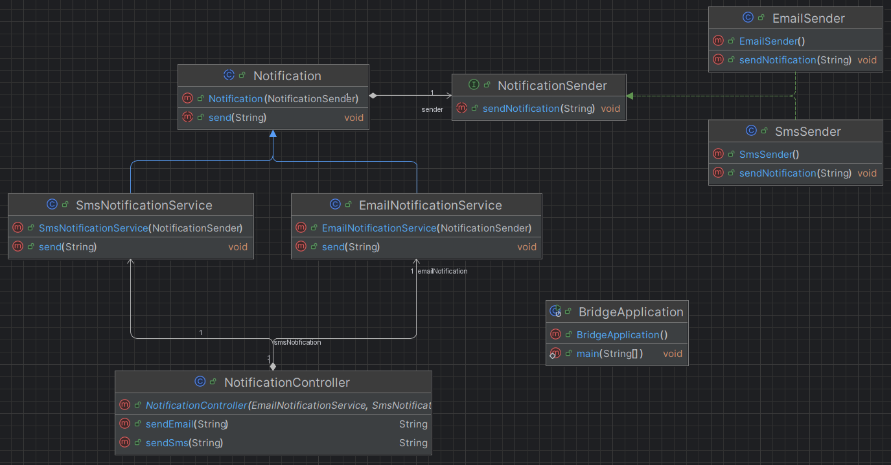
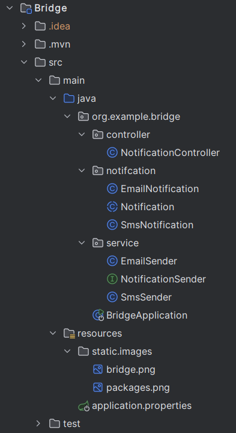

## ENG
# Example of the Bridge Pattern in Spring Boot

This project demonstrates the implementation of the **Bridge Pattern** in a Spring Boot application. The Bridge Pattern allows separating abstraction from implementation, making them independent and more flexible.

## Problem

Imagine that you need to send notifications through different channels (Email, SMS) for various events (Registration, Password Reset). Adding new types of notifications or channels can quickly lead to a large number of classes. To avoid this complexity, we use the Bridge Pattern.

## Main Components

1. **Abstraction (Notification)** — An abstract class that contains a reference to the notification sender.
2. **Implementor (NotificationSender)** — An interface for sending notifications.
3. **Concrete Implementors (EmailSender, SmsSender)** — Concrete implementations for sending notifications.
4. **Extended Abstractions (EmailNotification, SmsNotification)** — Concrete types of notifications that use different senders.

## How It Works

The Bridge Pattern separates abstraction (type of notification) from its implementation (sending mechanism). This makes the system scalable, allowing for easy addition of new types of notifications or sending mechanisms without changing existing code.

### Structure

- `Notification` — abstract class.
```java
public abstract class Notification {
   public NotificationSender sender;

   public Notification(NotificationSender sender) {
      this.sender = sender;
   }

   public abstract void send(String message);
}
```

- `EmailNotification` and `SmsNotification` — implementations of the `Notification` class.
```java
@Service
public class EmailNotification extends Notification {

    public EmailNotification(@Qualifier("emailSender") NotificationSender sender) {
        super(sender);
    }

    @Override
    public void send(String message) {
        sender.sendNotification("Email Notification: " + message);
    }
}

@Component
public class SmsNotification extends Notification {

   public SmsNotification(@Qualifier("smsSender") NotificationSender sender) {
      super(sender);
   }

   @Override
   public void send(String message) {
      sender.sendNotification("SMS Notification: " + message);
   }
}
```

- `NotificationSender` — interface implemented by `EmailSender` and `SmsSender` classes.
```java
public interface NotificationSender {
   void sendNotification(String message);
}

@Component
public class EmailSender implements NotificationSender {
   @Override
   public void sendNotification(String message) {
      System.out.println("Sending Email with message: " + message);
   }
}

@Component
public class SmsSender implements NotificationSender {
   @Override
   public void sendNotification(String message) {
      System.out.println("Sending SMS with message: " + message);
   }
}
```

### Example Classes
- `EmailSender` — sends notifications via email.
- `SmsSender` — sends notifications via SMS.
- `EmailNotification` uses `EmailSender` to send notifications.
- `SmsNotification` uses `SmsSender` to send notifications.

### Available Endpoints
- `/sendEmail?message=Hello` — sends a notification via Email.
- `/sendSms?message=Hello` — sends a notification via SMS.

### How to Run the Application
1. Clone the repository.
2. Run the application with the command:
    ```bash
    mvn spring-boot:run
    ```
3. Use the above endpoints to send notifications.
4. 
## Advantages of Using the Bridge Pattern

- **Flexibility** — You can add new ways to send notifications or new types of notifications without changing existing code.
- **Separation of Concerns** — The abstraction (notifications) is separated from the concrete implementation (sending mechanisms), simplifying the maintenance and extension of the application.

---


---

---

## RU

# Пример паттерна "Мост" на Spring Boot

Этот проект демонстрирует реализацию **паттерна "Мост"** в приложении на Spring Boot. Паттерн "Мост" позволяет разделить абстракцию от реализации, делая их независимыми и более гибкими.

## Проблема

Представьте, что нужно отправлять уведомления через разные каналы (Email, SMS) для различных событий (Регистрация, Сброс пароля). Добавление новых типов уведомлений или каналов может быстро привести к большому количеству классов. Чтобы избежать этой сложности, мы используем паттерн "Мост".

## Основные компоненты

1. **Абстракция (Notification)** — Абстрактный класс, который содержит ссылку на отправителя уведомлений.
2. **Реализатор (NotificationSender)** — Интерфейс для отправки уведомлений.
3. **Конкретные реализаторы (EmailSender, SmsSender)** — Конкретные реализации отправки уведомлений.
4. **Расширенные абстракции (EmailNotification, SmsNotification)** — Конкретные типы уведомлений, которые используют разные отправители.

## Как это работает

Паттерн "Мост" отделяет абстракцию (тип уведомления) от его реализации (механизма отправки). Это делает систему масштабируемой, позволяя легко добавлять новые типы уведомлений или механизмы отправки, не изменяя существующий код.

### Структура

- `Notification` — абстрактный класс.
- `EmailNotification` и `SmsNotification` — реализации класса `Notification`.
- `NotificationSender` — интерфейс, реализуемый классами `EmailSender` и `SmsSender`.

### Примеры классов

- `EmailSender` — отправляет уведомления через email.
- `SmsSender` — отправляет уведомления через SMS.
- `EmailNotification` использует `EmailSender` для отправки уведомлений.
- `SmsNotification` использует `SmsSender` для отправки уведомлений.

### Доступные эндпоинты

- `/sendEmail?message=Hello` — отправляет уведомление по Email.
- `/sendSms?message=Hello` — отправляет уведомление по SMS.

### Как запустить приложение

1. Клонируйте репозиторий.
2. Запустите приложение командой:
    ```bash
    mvn spring-boot:run
    ```
3. Используйте вышеуказанные эндпоинты для отправки уведомлений.

## Преимущества использования паттерна "Мост"

- **Гибкость** — можно добавлять новые способы отправки уведомлений или новые типы уведомлений без изменений существующего кода.
- **Разделение ответственности** — абстракция (уведомления) отделена от конкретной реализации (механизмов отправки), что упрощает поддержку и расширение приложения.

---


---

---